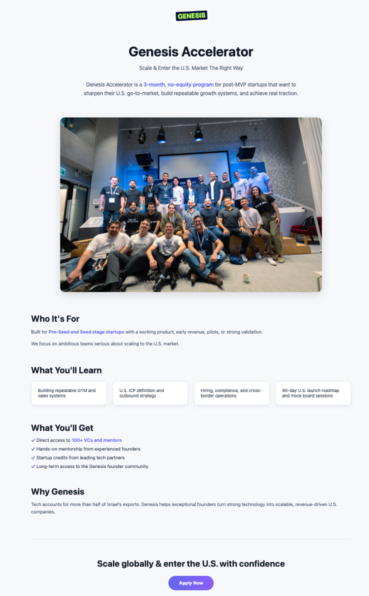
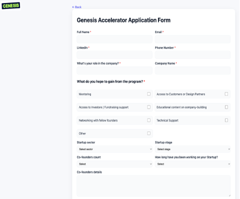
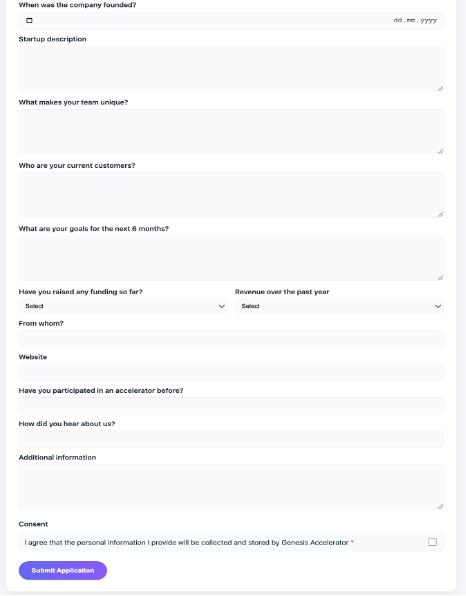
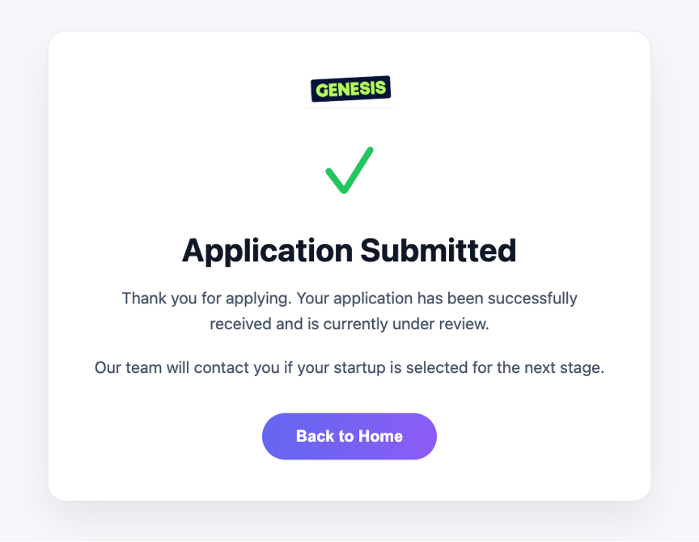
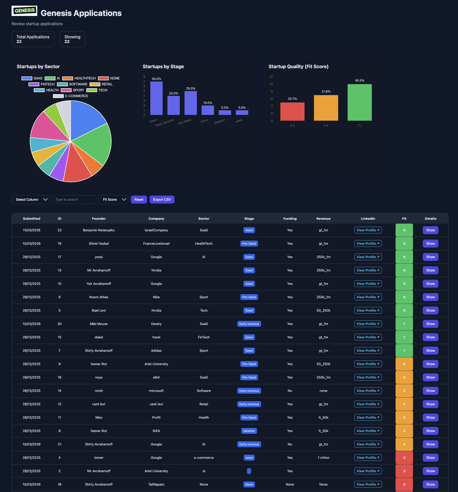

# Genesis Accelerator Application System

A web-based application management system for the **Genesis Accelerator** program.

This project demonstrates how a modern digital platform can streamline the startup application process while providing administrators with tools to analyze and manage applications efficiently.

The system includes:

• Landing page presenting the accelerator program  
• Startup application form  
• Submission confirmation page  
• Admin dashboard for reviewing and analyzing applications  

---

# Live Demo

Landing Page  
https://genesisaccelerator-web-h9aq.onrender.com/

Application Form  
https://genesisaccelerator-web-h9aq.onrender.com/apply

Submission Confirmation  
https://genesisaccelerator-web-h9aq.onrender.com/approval

Admin Dashboard  
https://genesisaccelerator-web-h9aq.onrender.com/admin

---

# Project Overview

The goal of this project was to redesign and improve the application experience for the **Genesis Accelerator program**.

Instead of creating only a static prototype, the project was expanded into a **fully functional web system** demonstrating a complete user flow from application submission to administrative review.

The system was built while applying **User Interface (UI)** and **User Experience (UX)** principles learned during the course.

---

# System Components

## Landing Page

The landing page presents the Genesis Accelerator program and provides a clear call-to-action for startups to apply.

Key design principles used:

• clear visual hierarchy  
• concise program explanation  
• credibility through real imagery  
• prominent "Apply Now" call-to-action  

The page allows users to quickly understand the program and proceed to the application form.

---

## Application Form

The application form collects structured information from startups applying to the accelerator.

Information collected includes:

• Founder details  
• Company information  
• Startup sector  
• Stage of development  
• Funding and revenue information  
• Startup description and goals  

The form includes:

• required fields validation  
• dropdown selections  
• date picker with validation  
• structured text inputs  

These mechanisms ensure **accurate and consistent data collection**.

---

## Submission Confirmation

After submitting the form, users receive a confirmation screen indicating that the application was successfully received and is under review.

Providing this confirmation improves user experience by giving clear feedback that the submission process was completed.

---

# Admin Dashboard

A dedicated **Admin Dashboard** was developed to allow program managers to review and analyze applications.

The dashboard includes:

• table displaying all submitted applications  
• sorting by different columns  
• filtering by multiple parameters  
• startup Fit Score ranking  
• CSV export functionality  

---

# Data Visualization

The system includes visual analytics to help administrators understand the overall applicant landscape.

Charts included:

• startups by sector  
• startups by stage  
• startup quality distribution (Fit Score)

These visualizations allow administrators to quickly identify trends and patterns.

---

# Advanced Filtering

The dashboard includes a flexible filtering system.

Filtering can be performed based on:

• sector  
• startup stage  
• funding status  
• revenue level  
• fit score  

Multiple filters can be combined to refine results and focus on specific groups of startups.

---

# Table Features

The application table supports dynamic sorting.

Example:

Clicking the **Fit Score** column sorts startups from highest to lowest score.

This allows administrators to quickly identify the most promising applicants.

---

# Export Functionality

Administrators can export the application dataset as a CSV file.

This allows further analysis using tools such as:

• Excel  
• Google Sheets  
• data analytics tools

---

# User Experience Principles

Several UX principles guided the system design:

### Visual Hierarchy

Content is organized so users immediately understand:

1. What the program is  
2. What value it provides  
3. What action they should take  

---

### Scan-Friendly Content

Information is divided into clear sections:

• Who the program is for  
• What participants will learn  
• What benefits they receive  

This allows users to quickly scan the page.

---

### Clear Call-to-Action

The **Apply Now** button provides a clear next step for users.

---

# Technology Stack

Frontend

• HTML  
• CSS  
• JavaScript  

Backend

• Python  
• Flask  

Data

• SQLite database  

Visualization

• Chart.js

---

# System Flow

User Journey:

Landing Page  
→ Application Form  
→ Submission Confirmation  

Admin Flow:

Admin Login  
→ Dashboard  
→ Filter & Analyze Applications  
→ Export Data

---
# Learning Outcomes

This project helped demonstrate:

• user interface design principles  
• full user flow design  
• web application architecture  
• data visualization for decision making  

By combining these elements, the project simulates how real-world digital platforms for startup programs can be designed.
